## Procedure

---

## Step 1: User Input Configuration

### 1.1 Enter the Knapsack Capacity
- Enter the Knapsack Capacity (`M`) in the corresponding input field.
- This represents the maximum weight the knapsack can hold.
- **Input Constraint:** Knapsack Capacity should be **≤ 200**.

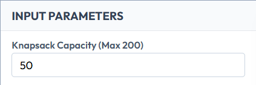

### 1.2 Enter Item Weights
- Enter the Item Weights as a comma-separated list of positive numbers.
- **Input Constraint:** Maximum **15 items** are allowed and each item’s weight should be **≤ 100**.

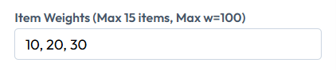

### 1.3 Enter Item Values
- Enter the Item Values as a comma-separated list corresponding to each item’s weight.
- **Input Constraint:** Each item’s value should be **≤ 2000**.

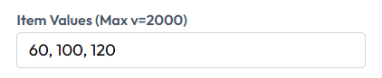

### 1.4 Input Validation
Ensure that:
- The number of weights and values are equal.
- All inputs are valid and within a reasonable range for smooth visualization.

(Optional)  
- Click the **Randomize** button to automatically generate sample weights and values.

---

## Step 2: Initialization of the Fractional Knapsack Algorithm

### 2.1 Start the Simulation
- Click the **Auto Play** or **Next Step** button to initialize the simulation.

### 2.2 Ratio Computation
- The algorithm computes the Value-to-Weight ratio (`V/W`) for each item.

### 2.3 Reset Visualization
- All visualization panels, result tables, knapsack fill indicator, and execution logs are reset to their initial states.

### 2.4 Knapsack Initialization
- The knapsack is initialized with zero filled weight and zero total value.

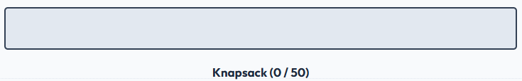

### 2.5 Sorting Preparation
- The algorithm prepares to process items in descending order of their value-to-weight ratio.

---

## Step 3: Selection of Execution Mode

Choose one of the following execution modes:

### (a) Manual Mode

- Click the **Next Step** button to execute the algorithm step-by-step.

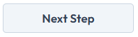

For each step:
- The next item with the highest value-to-weight ratio is selected.
- The algorithm checks whether the item can be fully accommodated in the knapsack.
- The active algorithm step is highlighted in the **Algorithm Steps** panel.

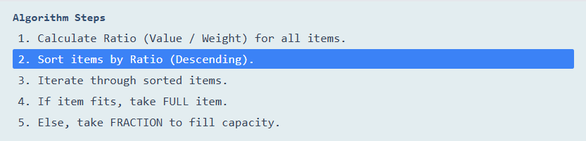

If the item fits completely:
- The full item is added to the knapsack.
- The knapsack fill level increases accordingly.

If the item does not fit completely:
- A fraction of the item is added to exactly fill the remaining capacity.

Additional control:
- Click the **Previous Step** button to revisit earlier steps without affecting the final result.

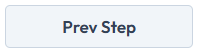

### (b) Automatic Mode

- Click the **Auto Play** button to allow the algorithm to execute automatically.

- Items are processed sequentially based on decreasing value-to-weight ratio.
- Knapsack filling is animated smoothly to visually represent full or fractional inclusion.
- Execution logs update dynamically to describe each decision taken by the algorithm.
- The simulation pauses automatically after the knapsack reaches full capacity.

---

## Step 4: Visualization of Knapsack Filling

- Observe the **Items Panel**, where items are displayed in sorted order of value-to-weight ratio.

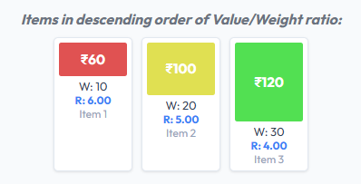

- Track the gradual filling of the **Knapsack Panel**, represented by a coloured progress fill.

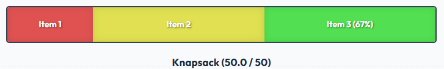

Notice:
- Full items increase the fill proportionally to their weight.
- Fractional items partially fill the remaining space.
- The current weight and maximum capacity are updated in real time.
- The result table records the fraction of each item taken along with its contribution to the total value.

---

## Step 5: Result Analysis and Completion

- Once the knapsack reaches its maximum capacity, the simulation displays **Completed**.
- The **Total Value** obtained is shown in the **Results** panel.

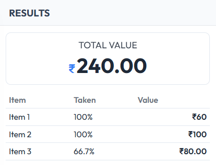

- The **Auto Play** button is disabled to indicate the completion of the experiment.
- The final state of the knapsack remains visible for verification.
- Click the **Reset** button to clear all inputs and restart the experiment.

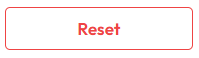

---
